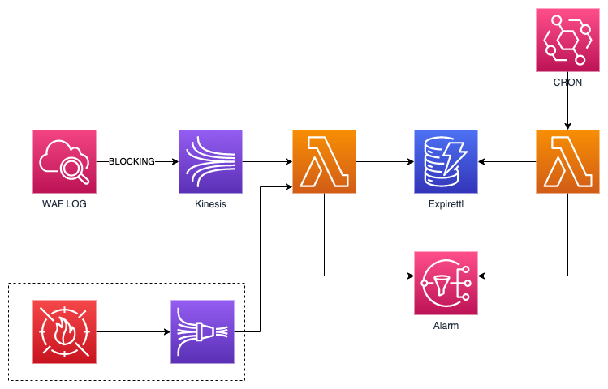

# WAF ALARM demo test

## architecture

## Overview

This architecture is used to send alarms to users under the condition that requests originate from the same IP address are blocked by AWS WAF more than three times within 5 minutes. Actually AWS WAF does natively have rate-based rules which can be used to trigger alarms, however, the minimum rate that rate-based rule can apply is at least 100 within 5 minutes. Therefore, such abnormal solution is used.

Even though the architecture itself looks a bit strange, it does offer a convenient way to send alarms. I would stick to this solution until better one comes out.

## Explanation

WAF logs can be enabled and stored to cloudwatch logs, within which detailed request info can be found. Cloudwatch log subscription filter is used to deliver the logs containing BLOCK to one kinesis data stream and then those logs are collected and analyzed by a lambda that will calculate the fequency of the requests coming from the same IP address. Once the fequency is detected to be above the threshold, lambda will send the request detail info to SNS topic resulting to alarm the user via email.
